# 视频素材语义搜索与聚类测试

> **验证结论：Gemini-embedding-2 配合 HDBSCAN 算法能实现语义检索，能通过语义聚类实现素材库的自动化整理。**

> **💡本项目基于 Gemini CLI 实现，本文档由 Gemini CLI 自己编写。**

---

## 🚀 核心实验结果

通过对 22 个单镜头素材的深度测试，验证了以下功能：
- **语义检索**: 延续了 MVP 版本的 100% 命中率，相似度区间在 0.35 - 0.50 之间。
- **语义聚类**: 成功将素材自动划分为 **6 个语义簇** + 1 个杂质组。
- **自动打标精度**: AI 生成的 `主体_场景_物件_氛围` 四维标签与素材内容匹配。

---

## 🛠️ 技术实现流程

1.  **视频向量化 (Gemini Embedding 2)**: 使用 `generate_embeddings.py` 将视频转化为 3072 维的高维特征向量。
2.  **语义检索**: 使用 `search_video.py` 进行余弦相似度计算，支持自然语言搜索。
3.  **智能聚类 (HDBSCAN)**: 
    *   通过密度聚类算法自动识别素材关联性，无需预设分类数。
    *   识别并剔除离群素材（Noise），归入 `Others` 文件夹。
4.  **自动归档命名 (Gemini 3.1 Flash Lite)**: 
    *   计算每个簇的几何重心，抽取代表性视频。
    *   利用 Gemini 3.1 进行画面分析并自动生成组合关键词文件夹名。

---

## 🖼️ 素材库预览 (Thumbnails)

以下是本项目测试所使用的 22 个单镜头素材预览：

| | | | |
| :---: | :---: | :---: | :---: |
| 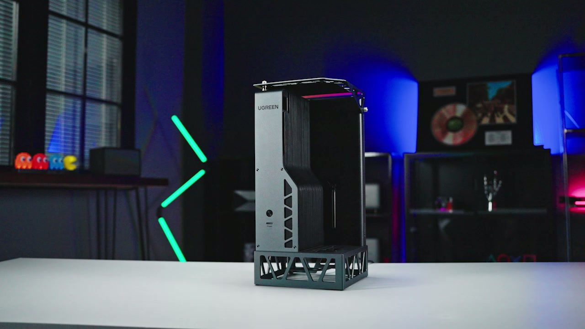 |  | 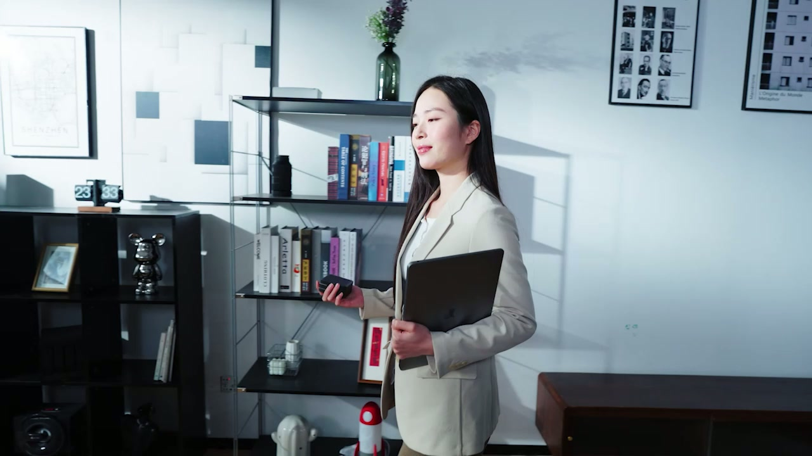 | 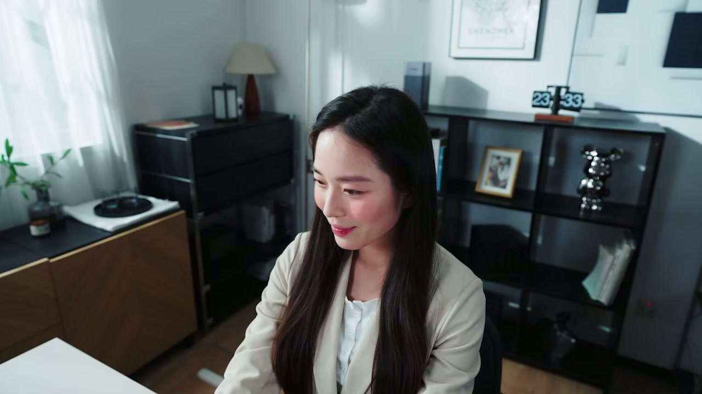 |
| 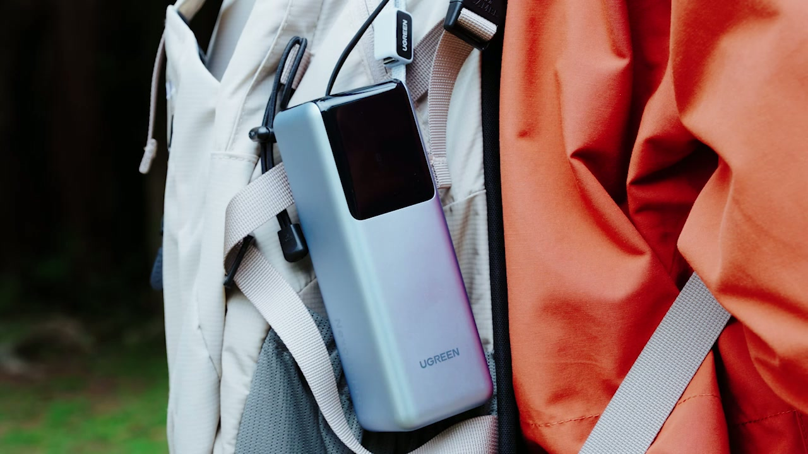 | 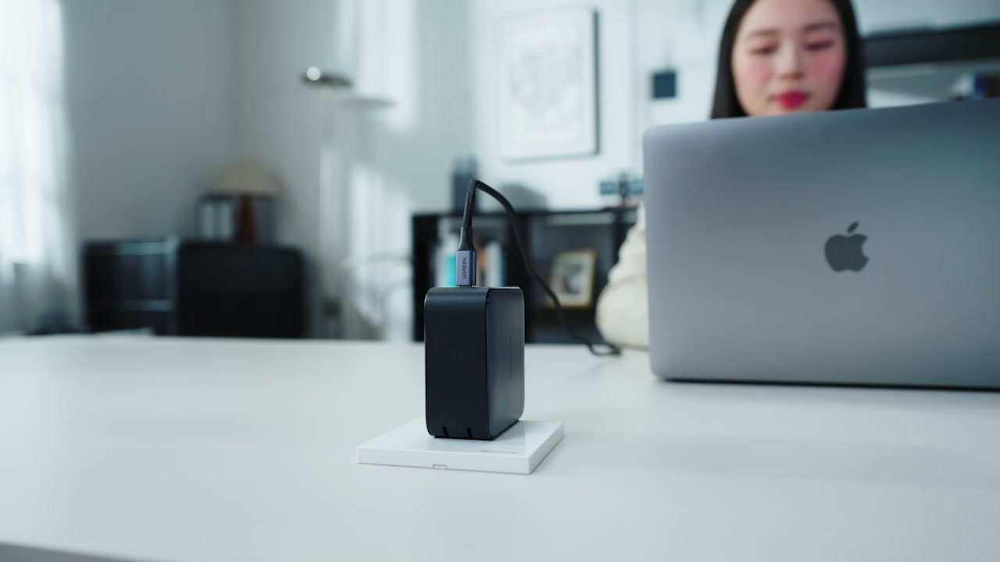 | 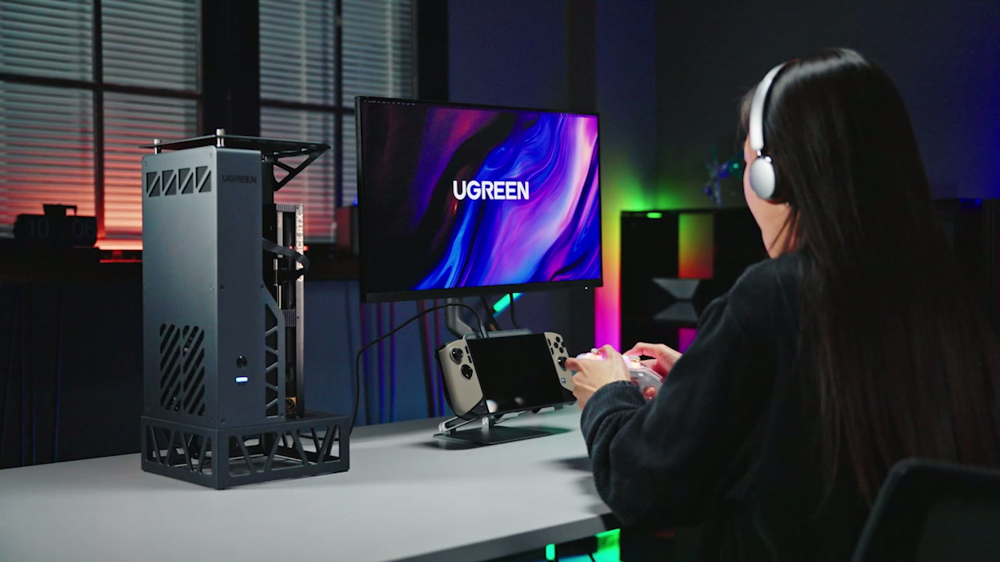 | 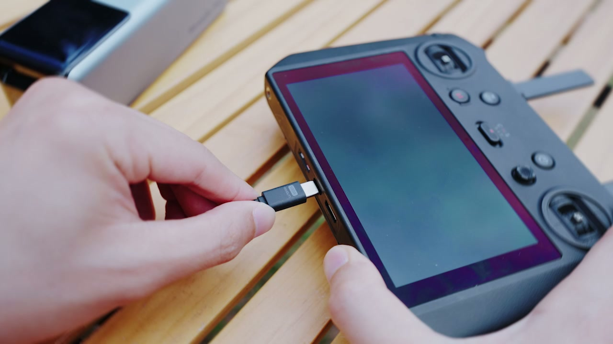 |
| 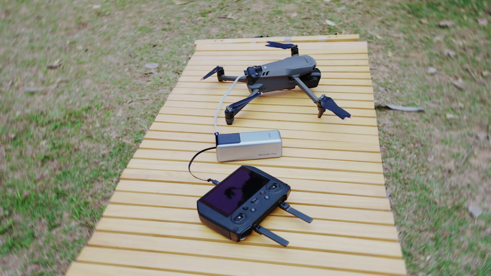 | 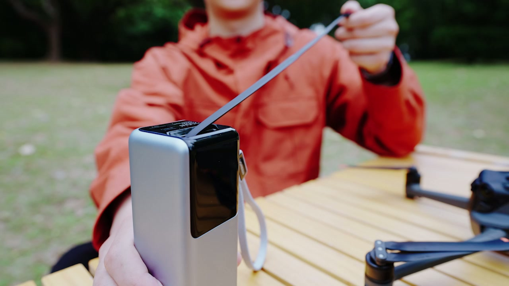 | 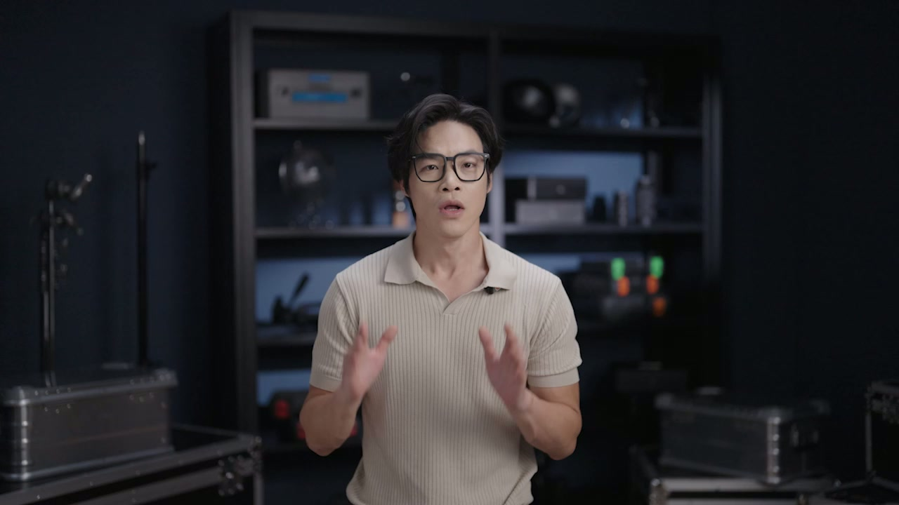 | 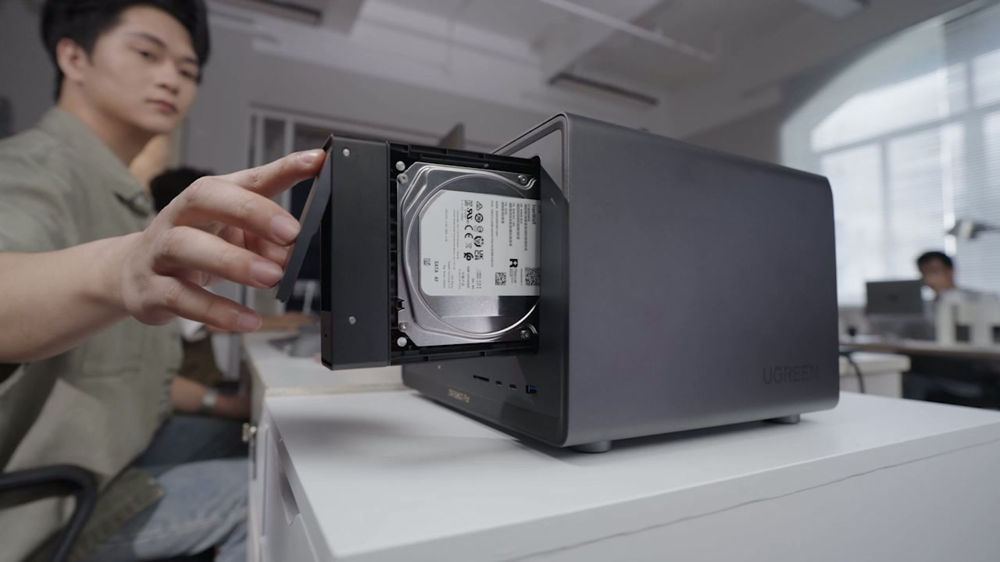 |
| 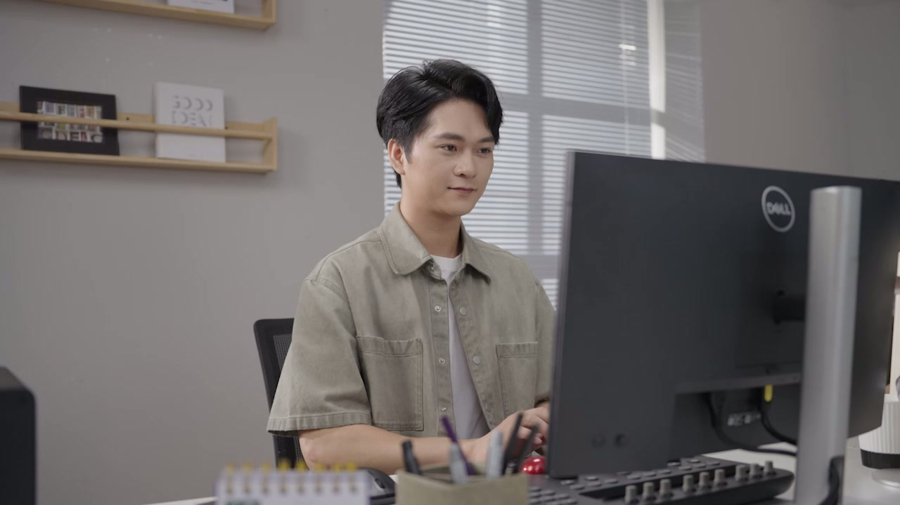 | 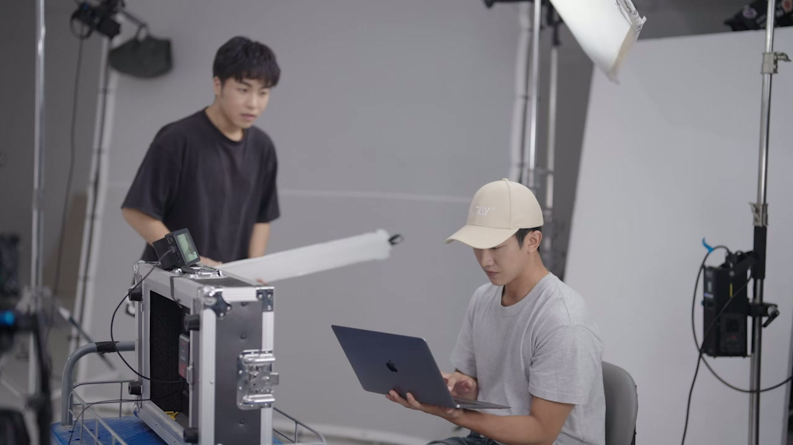 | 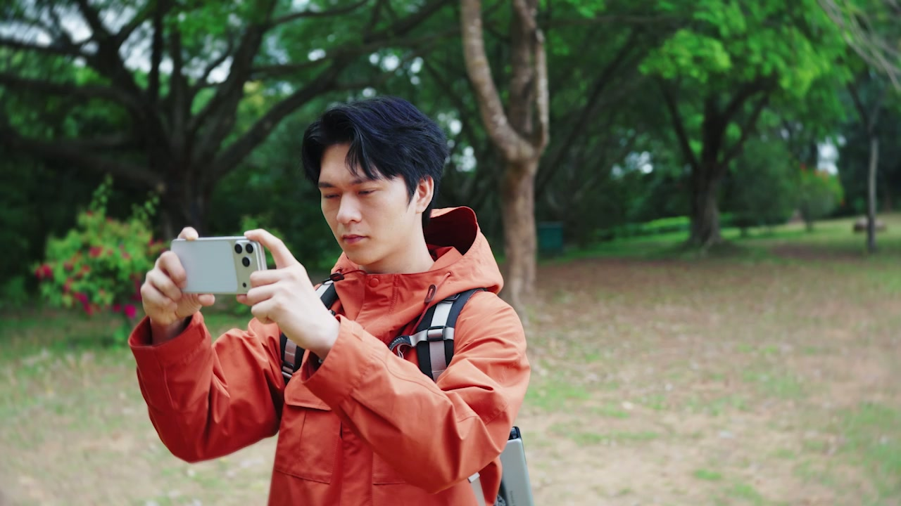 | 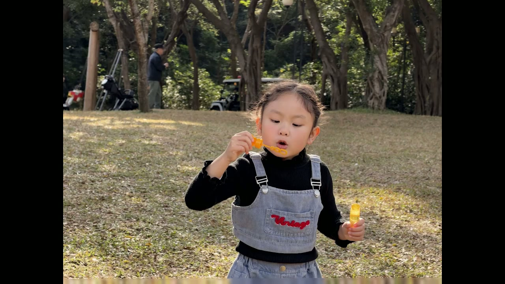 |

---

## 🔍 检索案例展示 (真实测试数据)

| 检索指令 (Query) | 匹配视频 (Top-1) | 相似度 | 画面内容 |
| :--- | :--- | :--- | :---: |
| 一个小女孩在公园面吹泡泡 | `IMG_1284.mp4` | 0.4422 |  |
| 一个拿着笔记本电脑的女性在办公室内行走 | `03_1.mp4` | 0.3994 |  |
| 一只手把硬盘推入桌面上的NAS | `25.mp4` | 0.4889 |  |
| 公园的板凳上放着无人机、遥控器 | `14.mp4` | 0.4786 |  |

---

## 📂 语义聚类归档案例 (New)

通过运行 `cluster_videos.py`，系统自动生成的目录结构如下：

| 自动生成的文件夹名 (语义标签) | 包含素材数 | 代表素材预览 | 归类逻辑描述 |
| :--- | :---: | :---: | :--- |
| **女孩_公园_泡泡棒_玩耍** | 2 |  | 成功提取出“泡泡棒”等细节，避开了乱码文件名的干扰。 |
| **职场女性_办公空间_笔记本电脑_高效商务** | 3 |  | 准确归类了所有职场女性相关的办公素材。 |
| **无人机_户外_充电宝_低电量续航** | 6 |  | 识别了无人机主体，并结合文件名提取了“续航/电量”功能点。 |
| **电脑主机_工作室_机箱_科技感** | 3 |  | 成功识别出了产品和“科技感”氛围。 |
| **年轻女性_室内办公空间_手机_演示无线投屏** | 2 |  | 极其精准地捕捉到了“无线投屏”这一核心动作语义。 |
| **Others (杂质类)** | 4 | - | 自动剔除了画面特征不明显的转场或无关镜头。 |

---

## 🚀 项目结构与使用

- `generate_embeddings.py`: 视频向量化核心脚本。
- `search_video.py`: 语义检索脚本。
- `cluster_videos.py`: **(New)** 语义聚类与自动归档归脚本。
- `convert_videos.py`: 视频批量转码工具（推荐先转为 720p 再运行）。
- `embeddings.json`: 视频特征数据库。

### 快速开始
1. 配置 `.env` 中的 `GOOGLE_API_KEY`。
2. 运行 `python generate_embeddings.py` 生成特征。
3. 运行 `python cluster_videos.py` 完成自动归档。

---
## 💡 项目意义
对于视频设计师，本工具将素材整理从“体力劳动”变为“指令自动化”。它不仅能帮你找到素材，更能帮你从逻辑上重构素材库，极大地释放了创作精力。
